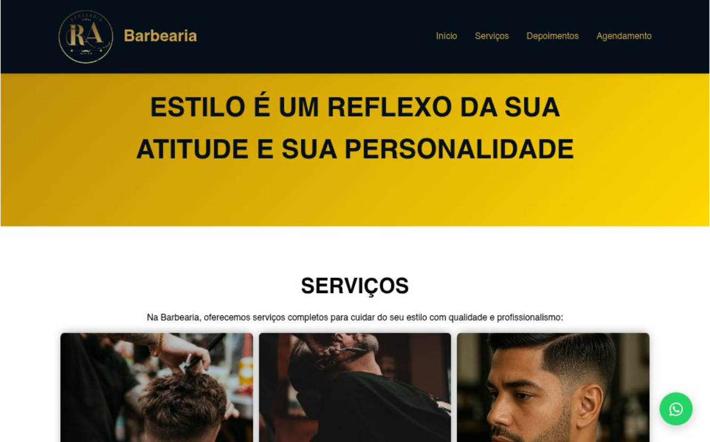

# 💈 Barbearia Vitrine - Landing Page Estilizada

> Uma interface moderna e com forte apelo visual desenvolvida para barbearias premium, focada em branding e agendamento de serviços.

## 🔗 Demonstração
**Veja o projeto online:** [Acesse aqui](https://barbearia-vitrine.vercel.app/)

---

## 💻 Sobre o Projeto
Este projeto foi desenvolvido para criar uma vitrine digital de alto impacto para uma barbearia. O foco foi trabalhar com uma estética "Dark Mode", utilizando contrastes que remetem ao ambiente clássico e sofisticado das barbearias modernas. Procurei destacar os serviços de forma visualmente rica para atrair e converter novos clientes.

## 🛠️ Tecnologias Utilizadas
- **HTML5:** Estruturação para apresentação de serviços e equipe.
- **CSS3:** Estilização avançada com foco em temas escuros e tipografia marcante.
- **Responsividade:** Layout adaptável para facilitar o acesso via smartphone.
- **Vercel:** Deploy e hospedagem.

## 🎨 Diferenciais Técnicos
- **Branding Visual:** Design que reforça a identidade visual do negócio.
- **Experiência do Usuário (UX):** Navegação simplificada para consulta de preços e localização.
- **Performance:** Carregamento otimizado para não perder o engajamento do usuário.

## 📸 Preview

---
### 👨‍💻 Contato
**Matheus Rodrigues** [LinkedIn](https://www.linkedin.com/in/matheus-rodrigues-4398423b9) | [GitHub](https://github.com/mathrodriguesdev-arch)
